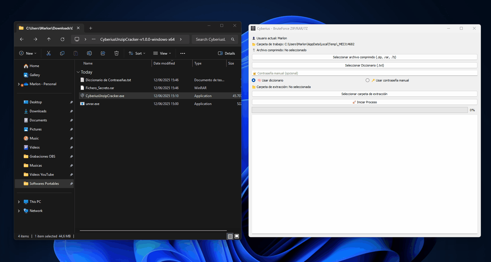

<p align="center">
  <a href="https://github.com/cyberiuscompany/Cyberius-Unzip-Cracker">
    
    <strong>Español</strong>
  </a>
  &nbsp;|&nbsp;
  
  <strong>English</strong>
  &nbsp;|&nbsp;
  <a href="https://www.youtube.com/watch?v=xvFZjo5PgG0&list=RDxvFZjo5PgG0&start_radio=1&pp=ygUTcmljayByb2xsaW5nIG5vIGFkc6AHAQ%3D%3D">
    
    <strong>日本語</strong>
  </a>
</p>

# CyberiusUnzipCracker

Graphical Python tool for recovering password-protected compressed files using brute force.  
- Supports `.zip`, `.rar`, and `.7z` formats. Ideal for forensic, recovery, or cybersecurity contexts.  
- DeepWiki link: https://deepwiki.com/cyberiuscompany/Cyberius-Unzip-Cracker

---

<p align="center">
  
</p>

---

## 🎥 Demonstration

<p align="center">
  
</p>

## Screenshots

<p align="center">
  
  
</p>

## ⚙️ Features

- ✅ PyQt5 graphical interface  
- ✅ Dictionary mode or manual password  
- ✅ Supports `.zip`, `.rar`, `.7z`  
- ✅ Progress bar and attempt log  
- ✅ Console with `dir` and summary file after extraction  
- ✅ Exports results to `.txt`  
- ✅ Custom Cyberius-style icon  

---

## 🧩 System Requirements

- Python 3.8+  
- Windows 64-bit  
- `unrar.exe` to extract `.rar` files  

---

## 📄 Additional Documentation

- [🔐 Security](.github/SECURITY.md)
- [📜 License](LICENSE)
- [🤝 Code of Conduct](.github/CODE_OF_CONDUCT.md)
- [📬 Contributing](.github/CONTRIBUTING.md)
- [📢 Support](.github/SUPPORT.md)
- [⚠️ Legal Notice](DISCLAIMER.md)

---

## Configure `unrar.exe` for `.rar` files

To make the program work correctly with `.rar` files, you need `unrar.exe` in the same directory as `Main.py`. Follow these steps:

1. **Download the official package from RARLab**:  
   👉 [https://www.rarlab.com/rar_add.htm](https://www.rarlab.com/rar_add.htm)

2. **Choose** _"Unsigned executables"_.  
   A file named `rarlng_unsigned.rar` will be downloaded.

3. **Extract** the `.rar` file contents.

4. Inside the `rarlng_unsigned\x64` folder, **find** `UnRAR.exe`.

5. **Rename** it to `unrar.exe`.

6. **Place** `unrar.exe` in the same folder as your `Main.py` file.

> ✅ After this, the program will be able to process `.rar` files without issue.

---

## ⚙️ Installation and Usage

### 1. Install from Source

You can clone or download this project and run it with Python:

```bash
git clone https://github.com/CyberiusCompany/Cyberius-Unzip-Cracker.git
cd Cyberius-Unzip-Cracker
pip install -r requirements.txt
python Main.py
```

---

### 2. Install as a Professional Package

You can also install it with `setup.py` to enable a global command:

```bash
git clone https://github.com/CyberiusCompany/Cyberius-Unzip-Cracker.git
cd Cyberius-Unzip-Cracker
pip install .
cyberiusunzip
```

---

### 3. Compile to `.exe` Format

To generate an executable (`.exe`) of **CyberiusUnzipCracker**  
with a custom icon and no console:

The final `.exe` will be located in:

```
dist/CyberiusUnzipCracker/CyberiusUnzipCracker.exe
```

#### Steps:

```bash
cd Cyberius-Unzip-Cracker
pip install pyinstaller
pyinstaller CyberiusUnzipCracker.spec
```

> ⚠️ Ensure `unrar.exe`, `cyberius.ico`, and other files are in the paths defined in the `.spec` file.
